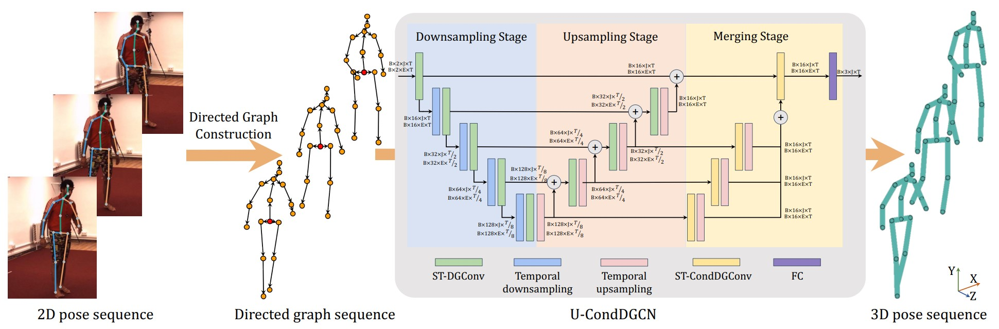
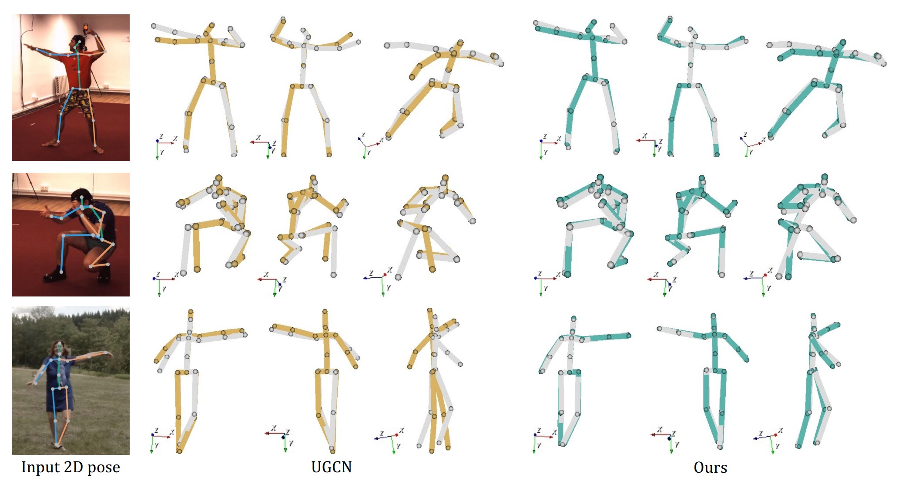

# U-CondDGCN: Conditional Directed Graph Convolution for 3D Human Pose Estimation

<a href="https://hits.seeyoufarm.com"></a>
</a>

<p align="center"></p>

This repo is the unofficial implementation of "[Conditional Directed Graph Convolution for 3D Human Pose Estimation](https://arxiv.org/abs/2107.07797), Wenbo Hu, Changgong Zhang, Fangneng Zhan, Lei Zhang, Tien-Tsin Wong" in PyTorch. There are many omitted parts in the paper. Therefore, note that there may be differences between actual papers and the way they are implemented. We welcome feedback on implementation errors.

## Abstract
Graph convolutional networks have significantly improved 3D human pose estimation by representing the human skeleton as an undirected graph. However, this representation fails to reflect the articulated characteristic of human skeletons as the hierarchical orders among the joints are not explicitly presented. In this paper, we propose to represent the human skeleton as a directed graph with the joints as nodes and bones as edges that are directed from parent joints to child joints. By so doing, the directions of edges can explicitly reflect the hierarchical relationships among the nodes. Based on this representation, we further propose a spatial-temporal conditional directed graph convolution to leverage varying non-local dependence for different poses by conditioning the graph topology on input poses. Altogether, we form a U-shaped network, named U-shaped Conditional Directed Graph Convolutional Network, for 3D human pose estimation from monocular videos. To evaluate the effectiveness of our method, we conducted extensive experiments on two challenging large-scale benchmarks: Human3.6M and MPI-INF-3DHP. Both quantitative and qualitative results show that our method achieves top performance. Also, ablation studies show that directed graphs can better exploit the hierarchy of articulated human skeletons than undirected graphs, and the conditional connections can yield adaptive graph topologies for different poses.

## Visualization
<p align="center"></p>

## Dependencies

- Cuda 11.1
- Python 3.8.11
- Pytorch 1.9.0+cu111

## Dataset setup

Please download the dataset from [Human3.6M](http://vision.imar.ro/human3.6m/) website and refer to [VideoPose3D](https://github.com/facebookresearch/VideoPose3D) to set up the Human3.6M dataset ('./dataset' directory). 

```bash
${POSE_ROOT}/
|-- dataset
|   |-- data_3d_h36m.npz
|   |-- data_2d_h36m_cpn_ft_h36m_dbb.npz
```

## Test the model

To test on pretrained model on Human3.6M:

```bash
python main.py --reload --previous_dir 'checkpoint/pretrained'
```

Here, we compare our U-CondDGCN with recent state-of-the-art methods on Human3.6M dataset. Evaluation metric is Mean Per Joint Position Error (MPJPE) in mm​. 


|   Types   |   Models    |  MPJPE   |
| :-------: | :---------: | :------: |
|    TCN    | VideoPose3D |   46.8   |
|    ViT    | PoseFormer  |   44.3   |
|    ViT    |  MHFormer   |   43.0   |
|    GCN    |     UGCN    |   45.6   |
|    GCN    | **U-CondDGCN** |   **43.4**   |


## Train the model

To train on Human3.6M:

```bash
python main.py --train
```

## Citation

If you find our work useful in your research, please consider citing:

    @misc{hu2021conditional,
          title={Conditional Directed Graph Convolution for 3D Human Pose Estimation}, 
          author={Wenbo Hu and Changgong Zhang and Fangneng Zhan and Lei Zhang and Tien-Tsin Wong},
          year={2021},
          eprint={2107.07797},
          archivePrefix={arXiv},
          primaryClass={cs.CV}
    }

## Acknowledgement

Our code is extended from the following repositories. We thank the authors for releasing the codes. 

- [3d-pose-baseline](https://github.com/una-dinosauria/3d-pose-baseline)
- [3d_pose_baseline_pytorch](https://github.com/weigq/3d_pose_baseline_pytorch)
- [VideoPose3D](https://github.com/facebookresearch/VideoPose3D)
- [ST-GCN](https://github.com/vanoracai/Exploiting-Spatial-temporal-Relationships-for-3D-Pose-Estimation-via-Graph-Convolutional-Networks)
- [MHFormer](https://github.com/Vegetebird/MHFormer)
- [UGCN](https://github.com/tamasino52/UGCN)
- [CondConv](https://github.com/nibuiro/CondConv-pytorch)
## Licence

This project is licensed under the terms of the MIT license.